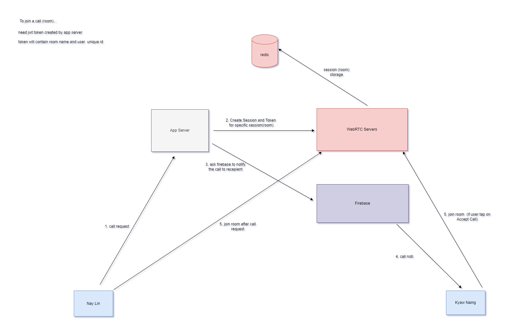

# webrtc_server

WebRTC Video Call SDK is built on top of open source livekit infrastructure ([livekit.io](https://livekit.io/)).

## proposed architecture for k-line chat use case

## Documentation
1. [Android SDK (Kotlin)](https://github.com/klinechatdev/webrtc_android_sdk)
2. [iOS SDK (Swift)](https://github.com/klinechatdev/webrtc_ios_sdk)
3. [Server SDK (Nodejs)](https://www.npmjs.com/package/livekit-server-sdk)
